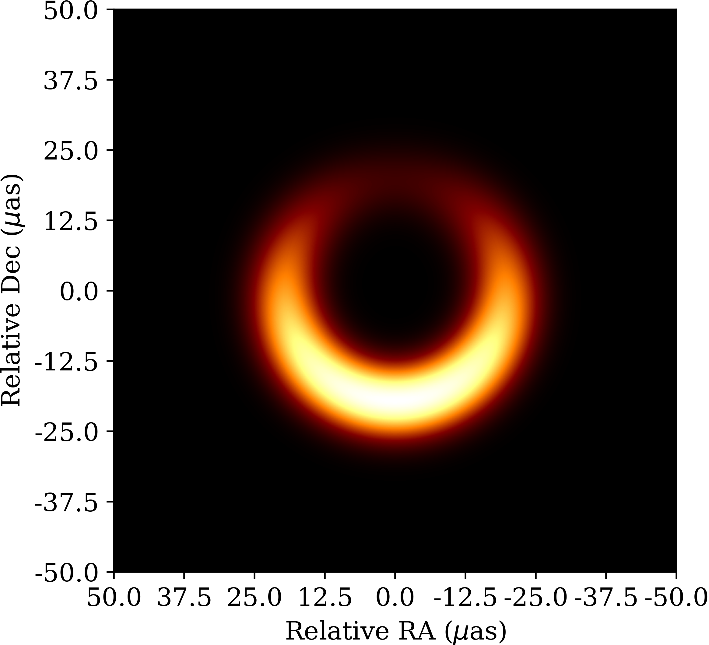
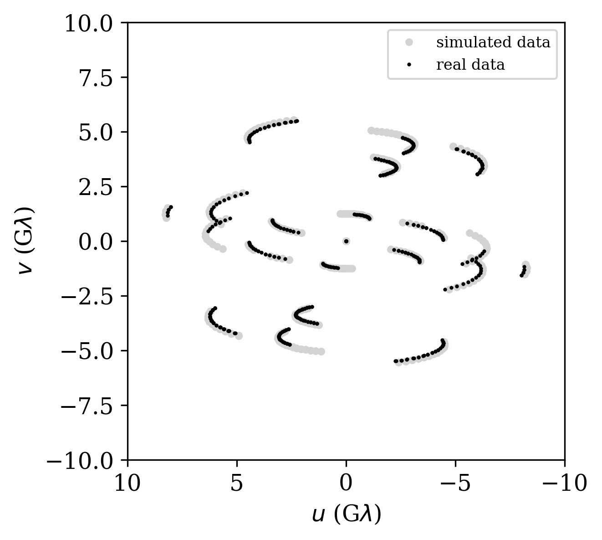
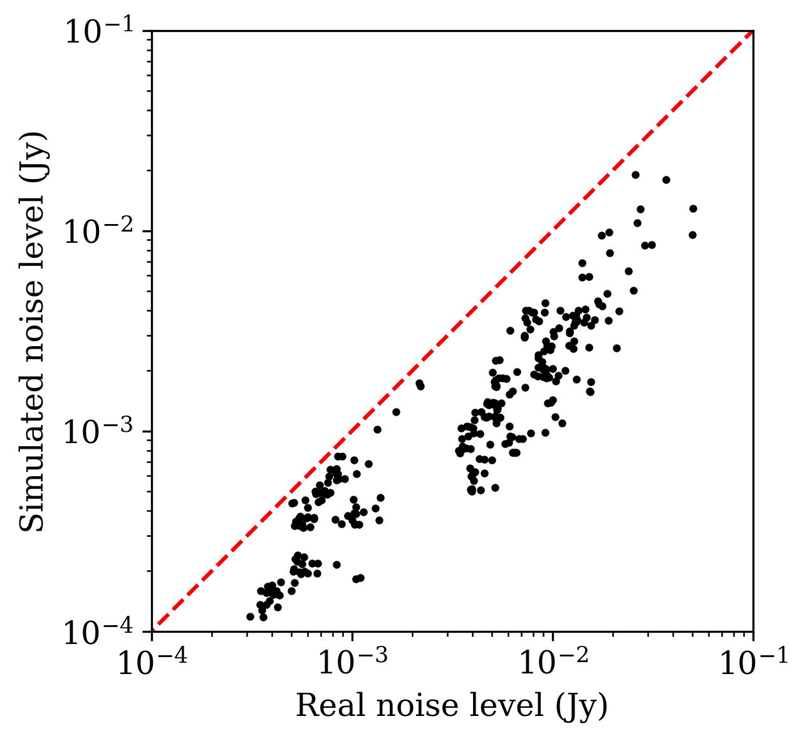
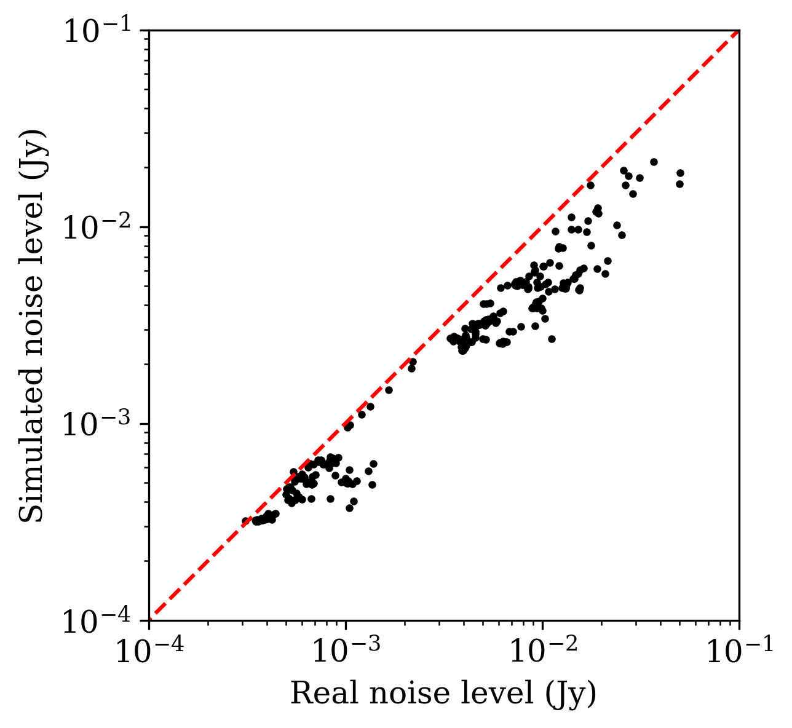

===============================
Tutorials
===============================

Generating an EHT-like dataset
===============================

The Event Horizon Telescope (`EHT <https://eventhorizontelescope.org/>`_) is a globe-spanning network of radio dishes that is most well-known for having gathered the data that were used to reconstruct the first image of the supermassive black hole in the heart of the M87 galaxy [#EHTM874]_.  The original EHT observations took place in April 2017 [#EHTM873]_, using an array that consisted of 7 distinct radio facilities [#EHTM872]_: `ALMA <https://en.wikipedia.org/wiki/Atacama_Large_Millimeter_Array>`_, `APEX <https://en.wikipedia.org/wiki/Atacama_Pathfinder_Experiment>`_, `IRAM <https://en.wikipedia.org/wiki/IRAM_30m_telescope>`_, `JCMT <https://en.wikipedia.org/wiki/James_Clerk_Maxwell_Telescope>`_, `LMT <https://en.wikipedia.org/wiki/Large_Millimeter_Telescope>`_, `SMA <https://en.wikipedia.org/wiki/Submillimeter_Array>`_, and `SMT <https://en.wikipedia.org/wiki/Heinrich_Hertz_Submillimeter_Telescope>`_.  In this tutorial, we will generate a synthetic dataset that attempts to emulate these 2017 EHT observations of M87.

We'll start by configuring the array appropriately, which in this case means specifying the appropriate ``obs_generator`` object settings.  Relevant fields to specify include:

* the source being observed (M87)
* the observing frequency (227.1 GHz)
* the bandwidth (2 GHz)
* the date of the observation (April 6, 2017)
* the starting time (1 UT) and duration (7 hours) of the observation
* the telescopes participating in the observation

We can package all of these settings into a dictionary::
   
   settings = {'source': 'M87',
               'frequency': 227.1,
               'bandwidth': 2.0,
               'month': 'Apr',
               'day': '6',
               'year': '2017',
               't_start': 1.0,
               'dt': 7.0,
               'weather': 'exact',
               'sites': ['ALMA', 'APEX', 'IRAM', 'JCMT', 'LMT', 'SMA', 'SMT']}

.. note::
   Note the specification of the "weather" field in this dictionary, which tells ngehtsim that we want to use the actual weather conditions specific to the selected date (rather than having the weather be randomly instantiated, which is the default behavior).

Once the settings have been specified, we can instantiate an ``obs_generator`` object::

   import ngehtsim.obs.obs_generator as og
   obsgen = og.obs_generator(settings)

Now we need to specify the emission structure of the source that will be observed.  For this example, we'll treat the M87 black hole image as being a simple ring-like structure with an azimuthal brightness modulation.  The flux density of the ring is about 0.6 Jy, its angular diameter is about 40 microarcseconds, and its thickness is about 10 microarcseconds.  We can use `ehtim <https://github.com/achael/eht-imaging>`_ to produce the source model::

   import ehtim as eh
   mod = eh.model.Model()
   mod = mod.add_thick_mring(F0 = 0.6,
                             d = 40.0*eh.RADPERUAS,
                             alpha = 10.0*eh.RADPERUAS,
                             beta_list=[-0.4])

We can now observe this source model with the specified array::

   obs = obsgen.make_obs(mod)

From here, we're able to carry out image reconstruction or any other analysis on the generated data, just as we would with real EHT data.

But how does this synthetic dataset compare to the actual observations?  To answer that, we'll first need to grab the actual EHT data, which is publicly available; the April 6 dataset can be found at `this link <https://datacommons.cyverse.org/browse/iplant/home/shared/commons_repo/curated/EHTC_FirstM87Results_Apr2019/uvfits/SR1_M87_2017_096_lo_hops_netcal_StokesI.uvfits>`_.  Let's read the uvfits file into an ehtim ``obsdata`` object and then carry out scan-averaging::

   obs_real = eh.obsdata.load_uvfits('SR1_M87_2017_096_lo_hops_netcal_StokesI.uvfits')
   obs_real.add_scans()
   obs_real = obs_real.avg_coherent(0.0,scan_avg=True)

And now we can compare the properties of the real and simulated datasets!  Let's first take a look at the `(u,v)`-coverage:

The agreement here looks pretty good; the main difference is that there are some tracks that are a bit longer in the synthetic data than they are in the real data.  It turns out that during the actual April 6, 2017 EHT observations, the SMT station suffered from some technical issues towards the beginning of the observing track that resulted in less data getting collected.  These technical issues are not simulated by ngehtsim, so it overpredicts the amount of data on baselines containing the SMT.

And how does the array sensitivity compare between the simulated and real datasets?  This question is a bit trickier to quantify, because we have not simulated the exact timestamps and detailed integration times, and so we expect the baseline sensitivities to fluctuate more in the real data than in the simulated data.  However, we can attempt to compensate for this effect by scaling the simulated dataset noise levels by the integration times achieved in the real data.  A short script that does some nearest-neighbor matching and integration time rescaling might look like::

   import numpy as np

   # set up a dictionary to translate between the
   # station codes used in the real data and the
   # station codes used in our simulation
   station_translation_dict = {'AA': 'ALMA',
                               'AP': 'APEX',
                               'PV': 'IRAM',
                               'JC': 'JCMT',
                               'LM': 'LMT',
                               'SM': 'SMA',
                               'AZ': 'SMT'}

   # extract the relevant simulated metadata
   simulated_timestamps = obs.data['time']
   simulated_station1 = obs.data['t1']
   simulated_station2 = obs.data['t2']

   # loop through the real data
   datalength = len(obs_real.data)
   real_noise_level = np.zeros(datalength)
   simulated_noise_level = np.zeros(datalength)
   for i in range(datalength):
       
       # match the baseline
       real_station1 = station_translation_dict[obs_real.data['t1'][i]]
       real_station2 = station_translation_dict[obs_real.data['t2'][i]]
       index = ((simulated_station1 == real_station1) & (simulated_station2 == real_station2))
       if (index.sum() == 0):
           index = ((simulated_station1 == real_station2) & (simulated_station2 == real_station1))

       # match the timestamp as closely as possible
       real_timestamp = obs_real.data['time'][i]
       simulated_timestamp = simulated_timestamps[index][np.argmin(np.abs(simulated_timestamps[index] - real_timestamp))]
       index &= (simulated_timestamps == simulated_timestamp)

       # retrieve the noise levels
       real_noise_level[i] = obs_real.data['sigma'][i]
       simulated_noise_level[i] = obs.data['sigma'][index]

       # scale by the relative integration times
       simulated_noise_level[i] /= np.sqrt(obs_real.data['tint'][i] / obs.data['tint'][index])

Plotting the resulting simulated noise levels versus the real ones, we find:

The dashed red line here marks the equality point, and we can see that the simulated data have a systematically lower noise level than the the real data.  What are we missing?  It turns out that there are a number of relevant elements of realism that we have left out of this simulation thus far, and to add them in we'll need to make some further refinements to the array characteristics.

Additional effects
-------------------------------

The calibration of the 2017 EHT data is comprehensively covered in `M87 Paper 3 <https://iopscience.iop.org/article/10.3847/2041-8213/ab0c57>`_, and a number of practical details are relevant for closing the sensitivity gap between our synthetic data and the real data.  Here, we use the information from that paper (particularly Table 2) to improve our simulation of the EHT 2017 observing campaign.

Though ngehtsim contains information about the diameter of each dish in the EHT array, not all dishes are always able to use their full collecting area.  For instance, during the 2017 EHT observing campaign, the ALMA array observed with only 37 dishes (out of ~60 in total), and the LMT was not able to use its full diameter of 50 meters.  To override the default dish sizes when simulating data with ngehtsim, we can specify a dictionary that gets passed to the ``obs_generator`` object::

   D_overrides = {'ALMA': 73.0,
                  'LMT': 32.5,
                  'SMA': 14.7}

Another relevant factor is that not all stations have the same backend equipment.  The default receiver setup assumed within ngehtsim is a "sideband separating" receiver, but during the 2017 EHT campaign the JCMT, LMT, and SMA sites all used "double sideband" receiver setups.  This means that they were operating with twice the system temperature as they would otherwise have done, which impacts their sensitivities.  To override the default sideband setup within ngehtsim, we can specify another dictionary that gets passed to the ``obs_generator`` object::

   sideband_ratio_overrides = {'IRAM': {'230': 2.663},
                               'JCMT': {'230': 1.25},
                               'LMT': {'230': 1.0},
                               'SMA': {'230': 1.0}}

The sideband ratio effectively sets a multiplier on the system temperature, such that a value of 0 corresponds to a perfectly sideband-separating receiver and a value of 1 corresponds to a perfect double sideband receiver.  Note that here we've also specified a nonzero sideband ratio for the IRAM 30-meter dish.  The IRAM dish in fact uses a sideband separating receiver, but this specification allows us to impart a multiplicative factor to the system temperature; such a factor is necessary because during the 2017 EHT observations, the IRAM dish suffered from instabilities in the signal chain that led to substantial amplitude loss.

Another relevant factor for station sensitivities is the receiver temperature.  The default assumed 230GHz receiver temperature within ngehtsim is 50K, which is the ALMA specification (see, e.g., `here <http://www.ece.virginia.edu/sis/Papers/band6.pdf>`_).  However, several of the sites during the 2017 EHT campaign observed using receivers with worse performance than the ALMA specification:

* The APEX receiver temperature is about 90K (see `here <https://www.apex-telescope.org/heterodyne/shfi/het230/characteristics/index.php#trec>`_).
* The IRAM receiver temperature is about 80K (see `here <https://www.iram.fr/GENERAL/calls/w21/30mCapabilities.pdf>`_)
* The LMT receiver temperature is about 70K (see `here <http://lmtgtm.org/single-pixel-1mm-receiver/>`_).
* The SMA receiver temperature is about 66K (see `here <https://lweb.cfa.harvard.edu/sma/memos/125.pdf>`_).
* The SMT receiver temperature is about 66K (see `here <https://aro.as.arizona.edu/?q=facilities/submillimeter-telescope>`_).

Within ngehtsim, we can override the default receiver temperatures by specifying yet another dictionary that will get passed to the ``obs_generator`` object::

   T_R_overrides = {'APEX': {'Band6': 90.0},
                    'IRAM': {'Band6': 80.0},
                    'LMT': {'Band6': 70.0},
                    'SMT': {'Band6': 66.0},
                    'SMA': {'Band6': 66.0}}

Note that we have to specify that the "Band6" receiver is the one whose temperature is being set.  ngehtsim contains default information -- such as lower and upper frequency bounds, receiver temperatures, and sideband separation ratios -- for all of the ALMA receivers.  Custom receivers can be supplied by a user by passing the "custom_receivers" keyword argument when initiating the ``obs_generator`` object.

Given all of the above corrections, we can now re-generate the observations.  This time, we will pass additional arguments to the ``obs_generator`` object that capture the above effects::

   obsgen = og.obs_generator(settings,
                             D_overrides = D_overrides,
                             sideband_ratio_overrides = sideband_ratio_overrides,
                             T_R_overrides = T_R_overrides)

And then after re-generating the observation::

   obs = obsgen.make_obs(mod)

We can re-examine the relative sensitivities between the simulated data and the real data:

This looks much better!  There are clearly some remaining unaccounted-for imperfections in the real data, but incorporating the above effects has removed the bulk of the large offset between the simulated and real noise levels.

References
========================

.. [#EHTM874] Event Horizon Telescope Collaboration et al. (2019) *First M87 Event Horizon Telescope Results. IV. Imaging the Central Supermassive Black Hole*, ApJL, 875, L4, DOI: `10.3847/2041-8213/ab0e85 <https://iopscience.iop.org/article/10.3847/2041-8213/ab0e85>`_

.. [#EHTM873] Event Horizon Telescope Collaboration et al. (2019) *First M87 Event Horizon Telescope Results. III. Data Processing and Calibration*, ApJL, 875, L3, DOI: `10.3847/2041-8213/ab0c57 <https://iopscience.iop.org/article/10.3847/2041-8213/ab0c57>`_

.. [#EHTM872] Event Horizon Telescope Collaboration et al. (2019) *First M87 Event Horizon Telescope Results. II. Array and Instrumentation*, ApJL, 875, L2, DOI: `10.3847/2041-8213/ab0c96 <https://iopscience.iop.org/article/10.3847/2041-8213/ab0c96>`_
